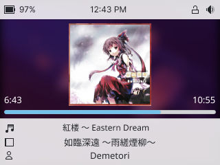
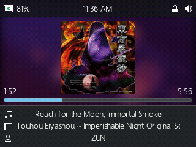
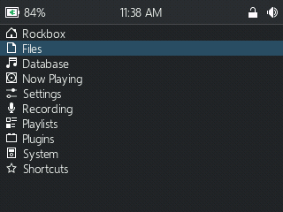

# breezepod

It's like a theme for the iPod Classic.

Contributions are welcome, just open a pull request.

## How to build

1. Clone the project on a computer with bash and imagemagick
2. Run the `create-theme.sh` script
3. Copy the `.rockbox` folder to your iPod

## Theme progress

* Light theme: 100%
* Dark theme: ~70% (I wouldn't use it)

## Screenshots

